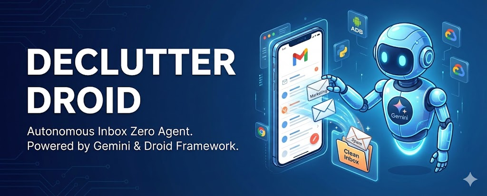
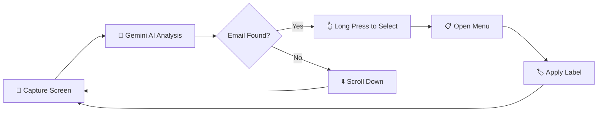

<div align="center">

# 🤖 Declutter Droid

### *Your AI-Powered Email Cleanup Assistant*

[](https://python.org)
[](https://ai.google.dev/)
[](https://developer.android.com/tools/adb)
[](LICENSE)



**Declutter Droid** is an intelligent AI agent that automatically cleans up your Gmail inbox by identifying and organizing marketing emails using **Google Gemini Vision AI** and **Android Debug Bridge (ADB)**.

[Features](#-features) •
[Demo](#-demo) •
[Installation](#-installation) •
[Usage](#-usage) •
[How It Works](#-how-it-works) •
[Tech Stack](#-tech-stack)

</div>

---

## 🌟 Features

| Feature | Description |
|---------|-------------|
| 🧠 **AI-Powered Detection** | Uses Gemini 2.0 Flash to intelligently identify marketing/spam emails |
| 📱 **Real-Time Screen Analysis** | Captures and analyzes your phone screen in real-time |
| 🏷️ **Smart Labeling** | Automatically moves emails to "Marketing" label |
| 🎯 **Multi-Brand Support** | Targets emails from Zomato, Swiggy, Flipkart, Coursera, Facebook, LinkedIn |
| 🔄 **Continuous Scanning** | Runs multiple scan loops to clean your entire inbox |
| 📸 **Debug Screenshots** | Saves screenshots for debugging and verification |

---

## 🎬 Demo

```
🚀 Declutter Droid 4.0 (Label Mode) Starting...
📱 Connected: Samsung M11
--- Scan 1 ---
📍 Long Pressing at 600, 450 (Zomato email detected)
🧹 Labeling Sequence...
🏷️ Selecting 'Marketing' checkbox...
✅ Confirming (OK)...
🎉 DONE!
```

---

## 📋 Prerequisites

Before you begin, ensure you have the following:

- ✅ **Python 3.9+** installed
- ✅ **Android Device** with Developer Options & USB Debugging enabled
- ✅ **ADB** (Android Debug Bridge) installed and configured
- ✅ **Google Gemini API Key** ([Get one here](https://ai.google.dev/))

---

## 🚀 Installation

### 1️⃣ Clone the Repository

```bash
git clone https://github.com/0011Ashwin/Declutter-Droid.git
cd Declutter-Droid
```

### 2️⃣ Create Virtual Environment (Recommended)

```bash
python -m venv env
# Windows
.\env\Scripts\activate
# macOS/Linux
source env/bin/activate
```

### 3️⃣ Install Dependencies

```bash
pip install -r requirements.txt
```

### 4️⃣ Configure Environment Variables

Create a `.env` file in the project root:

```env
GEMINI_API_KEY=your_gemini_api_key_here
```

### 5️⃣ Connect Your Android Device

```bash
# Check if device is connected
adb devices

# Expected output:
# List of devices attached
# XXXXXXXX    device
```

---

## 💡 Usage

### Run the Agent

```bash
python main.py
```

### What Happens Next?

1. 📱 **Launches Gmail** on your connected Android device
2. 🔍 **Scans the inbox** for marketing emails using AI vision
3. 👆 **Long-presses** to select the identified email
4. 📂 **Opens the menu** and navigates to "Label as"
5. 🏷️ **Applies "Marketing" label** to organize the email
6. 🔄 **Repeats** the process for more emails

---

## ⚙️ How It Works



### Architecture Overview

| Component | File | Purpose |
|-----------|------|---------|
| **Main Agent** | `main.py` | Core logic and workflow orchestration |
| **AI Prompts** | `prompts.py` | Structured prompts for Gemini vision analysis |
| **ADB Utilities** | `utils.py` | Android device interaction helpers |
| **Config** | `.env` | API keys and environment configuration |

---

## 🛠️ Tech Stack

<div align="center">

| Technology | Purpose |
|------------|---------|
|  | Core Programming Language |
|  | AI Vision & Decision Making |
|  | Android Device Control |
|  | Image Processing |

</div>

---

## 📁 Project Structure

```
Declutter-Droid/
├── 📄 main.py           # Main agent script
├── 📄 prompts.py        # AI prompt configurations
├── 📄 utils.py          # ADB utility functions
├── 📄 requirements.txt  # Python dependencies
├── 📄 .env              # Environment variables (create this)
├── 📁 Agent-output/     # Debug screenshots
└── 📄 README.md         # You are here!
```

---

## 🎯 Targeted Email Sources

The AI is trained to prioritize and identify emails from:

| Category | Brands |
|----------|--------|
| 🍕 **Food Delivery** | Zomato, Swiggy |
| 🛒 **E-Commerce** | Flipkart |
| 📚 **Education** | Coursera |
| 💼 **Social/Professional** | Facebook, LinkedIn |

---

## 🔧 Troubleshooting

| Issue | Solution |
|-------|----------|
| `GEMINI_API_KEY missing!` | Ensure `.env` file exists with valid API key |
| `No devices found` | Enable USB Debugging and reconnect device |
| `ADB Error` | Restart ADB server: `adb kill-server && adb start-server` |
| `Rate limit (429)` | Wait a few seconds; the agent auto-retries |

---

## 🤝 Contributing

Contributions are welcome! Feel free to:

1. 🍴 Fork the repository
2. 🌿 Create a feature branch (`git checkout -b feature/amazing-feature`)
3. 💾 Commit changes (`git commit -m 'Add amazing feature'`)
4. 📤 Push to branch (`git push origin feature/amazing-feature`)
5. 🔃 Open a Pull Request

---

## 📜 License

This project is licensed under the **MIT License** - see the [LICENSE](LICENSE) file for details.

---

## 👨‍💻 Author

<div align="center">

**Ashwin**

[](https://github.com/0011Ashwin)

</div>

---

<div align="center">

### ⭐ Star this repo if you found it helpful!

Made by Ashwin  Mehta **Droidrun DevSprint 2026**

</div>
