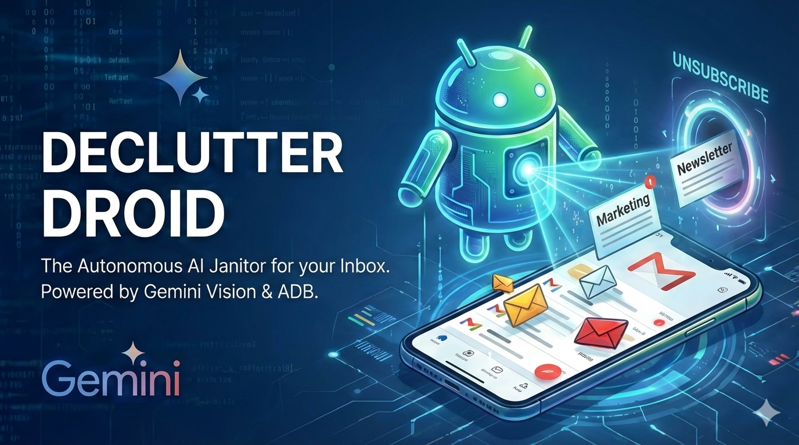
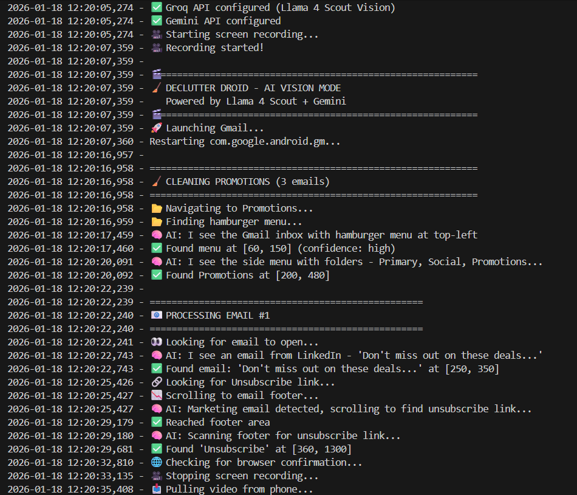
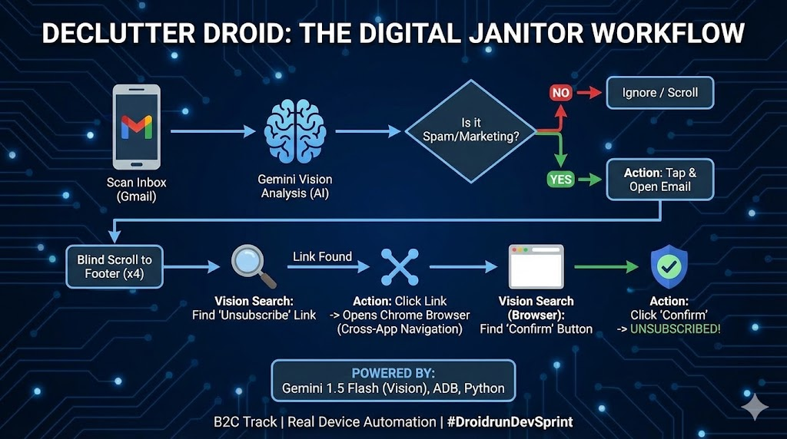

<div align="center">

# 🤖 Declutter Droid

### *Your AI-Powered Email Cleanup Assistant*

[](https://python.org)
[](https://ai.google.dev/)
[](https://groq.com)
[](https://developer.android.com/tools/adb)
[](LICENSE)

[](#)



**Declutter Droid** is an intelligent AI agent that automatically cleans up your Gmail inbox by identifying and organizing marketing emails using **Google Gemini Vision AI**, **Groq Llama 4 Scout Vision**, and **Android Debug Bridge (ADB)**.

---

> **Droidrun Agent**: This project is powered by both **Google Gemini** and **Groq Llama 4 Scout** for advanced AI vision and decision making. The agent leverages multi-model intelligence for robust, real-time email decluttering on Android devices.

[Features](#-features) •
[Demo](#-demo) •
[Installation](#-installation) •
[Usage](#-usage) •
[How It Works](#-how-it-works) •
[Tech Stack](#-tech-stack)

</div>

---

## 🌟 Features

| Feature | Description |
|---------|-------------|
| 🧠 **AI-Powered Detection** | Uses Gemini 2.0 Flash and Groq Llama 4 Scout to intelligently identify marketing/spam emails |
| 📱 **Real-Time Screen Analysis** | Captures and analyzes your phone screen in real-time |
| 🏷️ **Smart Labeling** | Automatically moves emails to "Marketing" label or unsubscribes from them |
| 🎯 **Multi-Brand Support** | Targets emails from Zomato, Swiggy, Flipkart, Coursera, Facebook, LinkedIn |
| 🔄 **Continuous Scanning** | Runs multiple scan loops to clean your entire inbox |
| 📸 **Debug Screenshots** | Saves screenshots for debugging and verification |

---

## 🎬 Demo

<div align="center">
  
</div>

[](https://youtube.com/shorts/jEt8TJ-FN7o?feature=share)

---

## 📋 Prerequisites

Before you begin, ensure you have the following:

- ✅ **Python 3.9+** installed
- ✅ **Android Device** with Developer Options & USB Debugging enabled
- ✅ **ADB** (Android Debug Bridge) installed and configured
- ✅ **Google Gemini API Key** ([Get one here](https://ai.google.dev/))
- ✅ **Groq API Key** ([Get one here](https://console.groq.com/keys)) (optional, for advanced AI vision)

---

## 🚀 Installation

### 1️⃣ Clone the Repository

```bash
git clone https://github.com/0011Ashwin/Declutter-Droid.git
cd Declutter-Droid
```

### 2️⃣ Create Virtual Environment (Recommended)

```bash
python -m venv env
# Windows
.\env\Scripts\activate
# macOS/Linux
source env/bin/activate
```

### 3️⃣ Install Dependencies

```bash
pip install -r requirements.txt
```

### 4️⃣ Configure Environment Variables

Create a `.env` file in the project root:

```env
GEMINI_API_KEY=your_gemini_api_key_here
GROQ_API_KEY=your_groq_api_key_here
```

### 5️⃣ Connect Your Android Device

```bash
# Check if device is connected
adb devices

# Expected output:
# List of devices attached
# XXXXXXXX    device
```

---

## 💡 Usage

### Run the Agent

```bash
python main.py
```

### What Happens Next?

1. 📱 **Launches Gmail** on your connected Android device
2. 🔍 **Scans the inbox** for marketing emails using AI vision
3. 👆 **Long-presses** to select the identified email
4. 📂 **Opens the menu** and navigates to "Label as" or "Unsubscribe"
5. 🏷️ **Applies "Marketing" label** or confirms unsubscribe
6. 🔄 **Repeats** the process for more emails

---

## ⚙️ How It Works

<div align="center">
  
</div>

```graph TD
  A[📸 Capture Screen] --> B[🧠 Gemini Vision Analysis]
  B --> C{Is it Spam?}
  
  C -->|No| D[⬇️ Ignore / Scroll]
  D --> A
  
  C -->|Yes| E[👆 Action: Tap & Open Email]
  E --> F[📉 Blind Scroll to Footer x4]
  
  F --> G[🔍 Vision Search: Find Unsubscribe Link]
  G --> H[🔗 Action: Click Link]
  
  H --> I[🌐 Opens Chrome Browser]
  I --> J[🧠 Vision Search: Find Confirm Button]
  J --> K[✅ Action: Click Confirm & Unsubscribe]
```

### Architecture Overview

| Component | File | Purpose |
|-----------|------|---------|
| **Main Agent** | `main.py` | Core logic and workflow orchestration |
| **AI Prompts** | `prompts.py` | Structured prompts for Gemini/Groq vision analysis |
| **ADB Utilities** | `utils.py` | Android device interaction helpers |
| **Config** | `.env` | API keys and environment configuration |

---

## 🛠️ Tech Stack

<div align="center">

| Technology | Purpose |
|------------|---------|
|  | Core Programming Language |
|  | AI Vision & Decision Making |
|  | Advanced Vision Model |
|  | Android Device Control |
|  | Image Processing |

</div>

---

## 📁 Project Structure

```
Declutter-Droid/
├── main.py           # Main agent script
├── prompts.py        # AI prompt configurations
├── utils.py          # ADB utility functions
├── requirements.txt  # Python dependencies
├── .env              # Environment variables (create this)
├── Agent-output/     # Debug screenshots
└── README.md         # You are here!
```

---

## 🎯 Targeted Email Sources

The AI is trained to prioritize and identify emails from:

| Category | Brands |
|----------|--------|
| 🍕 **Food Delivery** | Zomato, Swiggy |
| 🛒 **E-Commerce** | Flipkart |
| 📚 **Education** | Coursera |
| 💼 **Social/Professional** | Facebook, LinkedIn |

---

## 🔧 Troubleshooting

| Issue | Solution |
|-------|----------|
| `GEMINI_API_KEY missing!` | Ensure `.env` file exists with valid API key |
| `No devices found` | Enable USB Debugging and reconnect device |
| `ADB Error` | Restart ADB server: `adb kill-server && adb start-server` |
| `Rate limit (429)` | Wait a few seconds; the agent auto-retries |

---

## 🤝 Contributing

Contributions are welcome! Feel free to:

1. 🍴 Fork the repository
2. 🌿 Create a feature branch (`git checkout -b feature/amazing-feature`)
3. 💾 Commit changes (`git commit -m 'Add amazing feature'`)
4. 📤 Push to branch (`git push origin feature/amazing-feature`)
5. 🔃 Open a Pull Request

---

## 📜 License

This project is licensed under the **MIT License** - see the [LICENSE](LICENSE) file for details.

---

## 👨‍💻 Author

<div align="center">

**Ashwin**

[](https://github.com/0011Ashwin)

</div>

---

<div align="center">

### ⭐ Star this repo if you found it helpful!

Made by Ashwin  Mehta **Droidrun DevSprint 2026**

</div>

- Python 3.9+
- Android device with USB Debugging enabled
- ADB installed and configured
- API Keys:
  - [Groq API Key](https://console.groq.com/keys) (recommended)
  - [Gemini API Key](https://ai.google.dev/) (optional fallback)

---

## 🚀 Installation

```bash
# Clone repository
git clone https://github.com/0011Ashwin/Declutter-Droid.git
cd Declutter-Droid

# Create virtual environment
python -m venv env
.\env\Scripts\activate  # Windows
source env/bin/activate  # macOS/Linux

# Install dependencies
pip install -r requirements.txt
```

---

## ⚙️ Configuration

Create a `.env` file in the project root:

```env
GROQ_API_KEY=your_groq_api_key_here
GEMINI_API_KEY=your_gemini_api_key_here
```

Connect your Android device:

```bash
adb devices
# Should show your device as "device"
```

---

## 💡 Usage

```bash
# Demo mode (3 emails)
python main.py demo

# Full clean (5 emails)
python main.py full
```

---

## 🎬 Recording a Demo Video

### 1. The Setup (Split Screen Technique)

Judges need to see that the code is actually controlling the phone. **Do not just record the phone screen.**

| Left Side | Right Side |
|-----------|------------|
| Your Terminal/VS Code | Samsung M11 Mirror |

**Terminal Setup:**
- Make the font **LARGE** (Zoom in with `Ctrl +`)
- Judges should read the logs: `🧠 AI: I see an email from Zomato...`

**Phone Mirror Setup:**
```bash
# Install scrcpy (recommended)
scrcpy
```
> If you don't have scrcpy, physically record your phone with a tripod/webcam, but mirroring is cleaner.

---

### 2. Prepare the "Stage" (Your Inbox)

Don't let the AI hunt for random emails. **Stack the deck** to ensure a smooth run.

**Move 3 "Good" Spam Emails to the Top:**
- Find emails from big brands (Zomato, LinkedIn, Swiggy, Quora)
- These usually have clear "Unsubscribe" links
- Move them to the **Promotions folder** so they appear first

**Clear the Clutter:**
- Archive weird emails that might confuse the vision model
- Remove emails with no subject line or unusual layouts

---

## 🔄 How It Works

```
1. Launch Gmail → Navigate to Promotions folder
2. AI identifies promotional email → Opens it
3. Scrolls to email footer
4. AI finds "Unsubscribe" link → Clicks it
5. Browser opens → AI finds confirm button → Clicks it
6. Returns to inbox → Repeats
```

---

## 📁 Project Structure

```
Declutter-Droid/
├── main.py           # Core AI agent logic
├── prompts.py        # AI prompt templates
├── utils.py          # ADB utility functions
├── requirements.txt  # Dependencies
├── .env              # API keys (create this)
└── Agent-output/     # Debug screenshots
```

---

## 🔧 Troubleshooting

| Issue | Solution |
|-------|----------|
| No API key | Add `GROQ_API_KEY` or `GEMINI_API_KEY` to `.env` |
| No device found | Enable USB Debugging, run `adb devices` |
| Rate limited | Wait 30 seconds, agent auto-retries |
| Unsubscribe not found | Some emails hide it in images |

---

## 📜 License

MIT License — see [LICENSE](LICENSE) for details.

---

<div align="center">

**Built by [Ashwin](https://github.com/0011Ashwin)**

Droidrun DevSprint 2026

</div>
