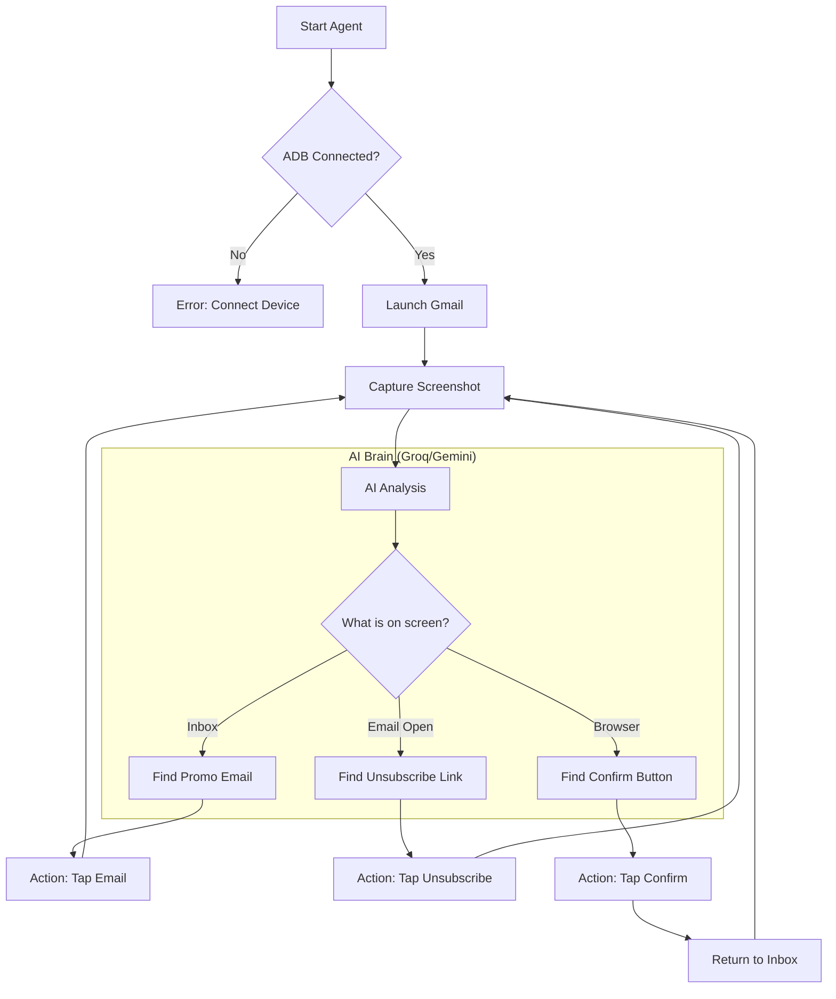

# 🧹 Declutter Droid - AI-Powered Digital Janitor


> **"Your messy inbox, cleaned by an AI agent that actually sees what it's doing."**

---

## 🚀 Overview

**Declutter Droid** is an intelligent automation agent built for the hackathon that autonomously cleans up your digital life. Unlike traditional automation scripts that rely on fragile, hardcoded coordinates, Declutter Droid uses **Vision LLMs (Llama 4 Scout & Gemini 2.0 Flash)** to "see" your screen and interact with apps just like a human would.

It navigates the Gmail app on Android via ADB, identifies marketing emails, finds those tricky "Unsubscribe" links buried in footers, and handles confirmation pop-ups—all without you lifting a finger.

---

## 💡 The "Agentic" Advantage

**For now, we know Google integrated Gemini into Gmail and Docs for content creation, but it still requires instruction and prompts. Declutter Droid is different—it is an autonomous agent that can perform the cleanup itself, proactively managing your digital space without constant supervision.**

---

## ✨ Features

- **🧠 Dual-Core Vision Intelligence**  
  Powered by **Groq Llama 4 Scout** (primary vision) and **Google Gemini 2.0 Flash** (fallback), ensuring high-accuracy detection of UI elements.

- **👁️ True Visual Navigation**  
  No hardcoded XY coordinates. The agent analyzes screenshots in real-time to find buttons, menus, and links dynamically. It adapts to different screen sizes and UI updates automatically.

- **🛡️ Smart Unsubscribe**  
  Intelligently hunts for "Unsubscribe," "Opt-out," and "Manage Preferences" links, even when hidden in tiny footer text.

- **📱 Non-Intrusive Android Automation**  
  Runs on your local machine and controls your Android device via ADB, ensuring your data stays on your device until analyzed.

---

## 🛠️ How It Works

Declutter Droid follows a "See-Think-Act" loop:



### Visual Workflow


---

## 📸 Demo in Action

The agent runs directly in your terminal, providing real-time "thoughts" on what it sees and does.


🎬 [**Watch the Demo on YouTube**](https://youtube.com/shorts/jEt8TJ-FN7o?si=TajA1X6T_oXw6A7i)

---

## ⚙️ Installation & Setup

### Prerequisites
- **Python 3.10+**
- **ADB (Android Debug Bridge)** installed and added to PATH.
- **Android Device** with USB Debugging enabled.

### 1. Clone the Repository
```bash
git clone https://github.com/yourusername/declutter-droid.git
cd declutter-droid
```

### 2. Set Up Environment
```bash
# Create virtual environment
python -m venv env

# Activate it
source env/bin/activate  # Windows: env\Scripts\activate

# Install dependencies
pip install -r requirements.txt
```

### 3. Configure API Keys
Create a `.env` file in the root directory:
```env
GEMINI_API_KEY=your_gemini_key_here
GROQ_API_KEY=your_groq_key_here
```

---

## 🎮 Usage

Connect your Android phone via USB and run the agent:

### ⚡ Quick Demo (Processes 3 emails)
```bash
python main.py demo
```

### 🧹 Full Clean (Processes 5+ emails)
```bash
python main.py full
```

---

## 🏗️ Tech Stack

- **Core**: Python
- **AI/Vision**: Groq (Llama 4 Scout), Google Gemini 2.0 Flash
- **Control**: ADB (Android Debug Bridge), pure-python-adb
- **Image Processing**: PIL (Pillow)

---

## 👨‍💻 Contributors

Built with ❤️ for the Hackathon.

---
*Note: This project is a proof-of-concept prototype. Always review what the agent is unsubscribing from.*